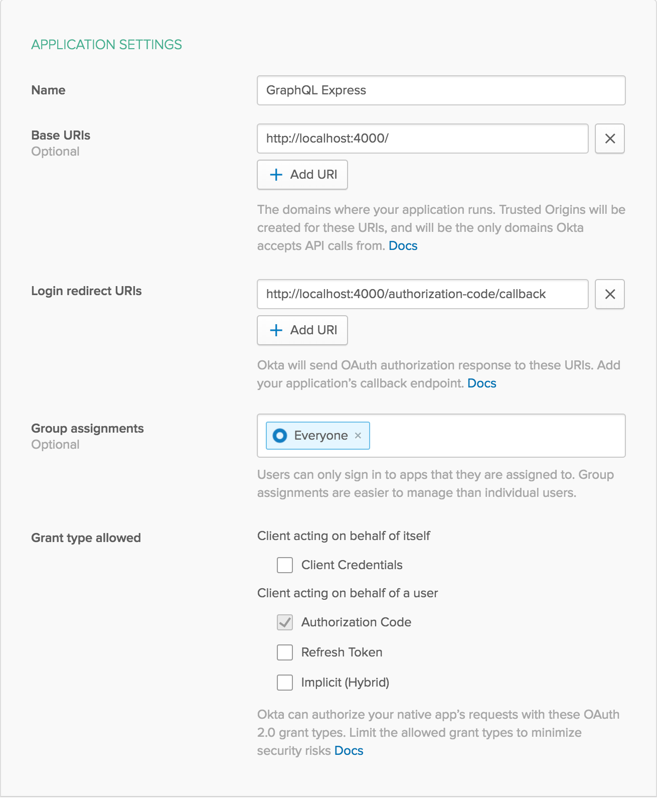

# Example API Using GraphQL, Express, and Okta

This is an example API, showing how to create a GraphQL endpoint in Node. The mutations are protected behind authentication provided by Okta.

**Prerequisites**: [Node.js](https://nodejs.org/en/).

## Getting Started

To install this example application, run the following commands:

```bash
git clone git@github.com:oktadeveloper/okta-express-graphql-example.git
cd okta-express-graphql-example
npm install
```

This will install a local copy of the project. You will need to set up some environment variables before the app will run properly.

To integrate Okta's Identity Platform for user authentication, you'll first need to:

* [Sign up for a free Okta Developer account](https://www.okta.com/developer/signup/)
* You will get a URL similar to `https://dev-123456.oktapreview.com`.
  * Save this URL for later
  * You will also use this URL to login to your Okta account

You will need to create an application in Okta:

* Log in to your Okta account, then navigate to **Applications** and click the **Add Application** button
* Select **Web** and click **Next**
* Give your application a name (e.g. "GraphQL Express")
* Change the **Base URI** to `http://localhost:4000/` and the **Login redirect URI** to `http://localhost:4000/implicit/callback`, then click **Done**
* Save your **Client ID** and **Client Secret** for later

Your Okta application should have settings similar to the following:



You will also need to create an API token in Okta:

* Log in to your Okta account, then navigate to **API > Tokens** and click the **Create Token** button
* Enter a name that will help you remember what this is used for (e.g. "GraphQL Express")
* Save the provided **token value** for later
  * This will only be displayed once. If you lose it, you will need to create another API token

Now create a file called `.env` in the project root and add the following variables, replacing the values with your own from the previous steps.

**.env**
```bash
HOST_URL=http://localhost:4000
OKTA_ORG_URL=https://{yourOktaOrgUrl}
OKTA_CLIENT_ID={yourClientId}
OKTA_CLIENT_SECRET={yourClientSecret}
OKTA_TOKEN={yourOktaToken}
```

You also need an app secret. One way to get a random `APP_SECRET` is to use the following command line, which will generate a random value and add it to your `.env` file.

```bash
echo "APP_SECRET=`openssl rand -base64 32`" >> .env
```

Now you can run the React frontend with the following command:

```bash
npm start
```

## Links

This example uses the [Okta Node SDK](https://github.com/okta/okta-sdk-nodejs), the [Okta JWT Verifier](https://github.com/okta/okta-oidc-js/tree/master/packages/jwt-verifier), and the [Okta OIDC Middleware](https://github.com/okta/okta-oidc-js/tree/master/packages/oidc-middleware).

## Help

Please [raise an issue](https://github.com/oktadeveloper/okta-express-graphql-example/issues) if you find a problem with the example application, or visit our [Okta Developer Forums](https://devforum.okta.com/). You can also email [developers@okta.com](mailto:developers@okta.com) if would like to create a support ticket.

## License

Apache 2.0, see [LICENSE](LICENSE).
